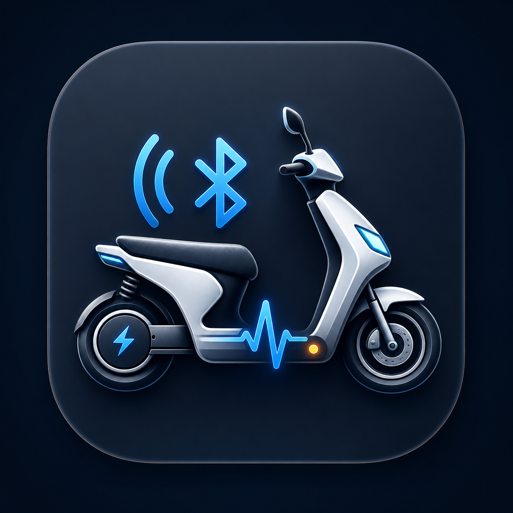

# YD E-Bike Helper

<p align="center">
  
</p>

`YD E-Bike Helper` 是一款运行于 macOS 的雅迪（YADEA）电动车 BLE 蓝牙调试工具，可用于发现设备、建立连接、查看通信日志以及发送常用调试指令。

> 本项目是独立开发的非官方工具，与雅迪科技集团有限公司无隶属或授权关系。请仅连接和调试属于自己或已获得明确授权的设备。

## 主要功能

- 扫描附近名称以 `YD` 开头的 BLE 设备
- 展示设备名称、信号强度、系统标识和广播数据
- 从设备广播信息中识别 MAC 地址，也支持手动输入
- 连接设备并完成认证流程
- 发送调试、还原和音量设置指令
- 支持发送自定义 HEX 数据
- 查看 GATT 服务、特征及收发日志

## 系统要求

- macOS 13 Ventura 或更高版本
- 支持蓝牙的 Mac
- Apple Silicon 或 Intel 处理器

## 下载与安装

从 [Releases](https://github.com/CBDT-JWT/yd-ebike-helper/releases/latest) 下载 `yd-ebike-helper-macOS.zip`。

1. 解压下载的 ZIP 文件。
2. 将 `YD E-Bike Helper.app` 拖入“应用程序”文件夹。
3. 首次启动时允许应用使用蓝牙。
4. 如果 macOS 阻止打开，请前往“系统设置 → 隐私与安全性”，在安全性提示中选择“仍要打开”。

## 使用方法

1. 打开应用并点击“刷新扫描”。
2. 从设备列表中选择目标雅迪电动车。
3. 核对自动识别的 MAC 地址；无法自动识别时可手动填写。
4. 点击连接，等待设备认证和 GATT 服务发现完成。
5. 使用车辆控制指令，或在高级区域发送自定义 HEX 数据。
6. 通过通信日志查看连接、认证、写入和通知结果。

设备 MAC 地址通常会从广播数据中自动识别。不同车型、控制器版本或固件的广播格式可能不同，因此部分设备仍需手动输入。

## 从源码构建

项目使用 SwiftUI、CoreBluetooth 和 Swift Package Manager，运行以下命令即可测试和打包：

```bash
swift test
zsh scripts/build-app.sh
```

打包完成后会生成：

```text
dist/yd-ebike-helper-macOS.zip
```

## 注意事项

- 调试指令可能改变车辆控制器的配置，请在了解指令效果后操作。
- 请勿在车辆行驶过程中连接或发送调试指令。
- 不同车型和固件版本的兼容性可能存在差异。
- 本工具不提供绕过车辆安全机制、所有权验证或访问控制的功能。
